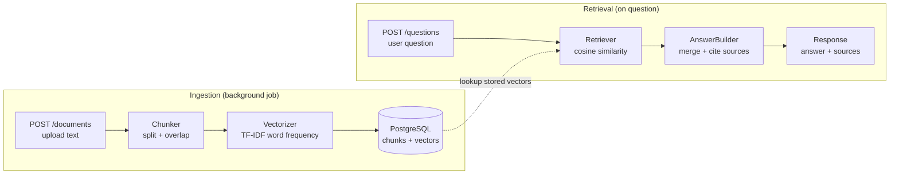

# Knowledge Assistant (No External AI API)

A simple Rails app that lets users upload text documents and ask questions.
Answers are built using internal retrieval logic only (no OpenAI and no external AI API).

## How it works



**Left side** — user uploads a document. A background job splits it into chunks, computes TF-IDF vectors, and stores everything in PostgreSQL.

**Right side** — user asks a question. The retriever vectorizes the question, compares it against stored chunks via cosine similarity, and the answer builder assembles a response with sources.

## What this project does

1. **Content ingestion**
   - User uploads/pastes text.
   - Document is stored in `documents.original_text`.
   - A background job processes it.

2. **Chunking**
   - Text is split into paragraphs, then into smaller chunks.
   - Chunk overlap is added so context near boundaries is not lost.

3. **Embedding simulation**
   - Each chunk is converted into a local TF-IDF-like hash vector.
   - Stopwords are removed and scores are normalized.

4. **Retrieval**
   - User question is vectorized with the same logic.
   - Cosine similarity is calculated against stored chunks.
   - Top relevant chunks are selected.

5. **Answer generation**
   - Answer is composed from top chunks (extractive style).
   - Sources are included (`document_title`, section/chunk index, similarity score).

## Tech stack

- Ruby 3.4.4
- Rails 8
- PostgreSQL
- Sidekiq (background job processing)
- RSpec + RuboCop

## Quick setup

### 1) Install dependencies

```bash
bundle install
```

### 2) Configure environment

Create `.env` in the project root:

```bash
DATABASE_HOST=localhost
DATABASE_PORT=5432
DATABASE_USERNAME=admin
DATABASE_PASSWORD=12345678
```

### 3) Prepare database

```bash
bin/rails db:create db:migrate
```

### 4) Seed sample documents (optional)

Three documents are included out of the box so you can try the app right away:

- Ruby on Rails History
- Computer History
- AI History

```bash
bin/rails db:seed
```

This will create the documents and process them (chunking + vectorization) immediately, so they are ready for questions as soon as the seed finishes.

Once seeded, try asking a question via the API:

```bash
curl -X POST http://localhost:3000/api/v1/questions \
  -H "Content-Type: application/json" \
  -d '{"question": "What is Ruby on Rails?"}'
```

Or open `http://localhost:3000/questions/new` in the browser and type "What is Ruby on Rails?"

### 5) Run app + worker

Terminal 1:

```bash
bin/rails server
```

Terminal 2:

```bash
bundle exec sidekiq
```

Open: `http://localhost:3000`

## How to use

1. Upload text (paste text or `.txt` file).
2. Wait until document status is `ready`.
3. Go to Ask Question page and submit a question.
4. Review answer + source list.

## JSON API

In addition to the web interface, there is a JSON endpoint to show how I would build an API in Rails.

### `POST /api/v1/questions`

**Request:**

```bash
curl -X POST http://localhost:3000/api/v1/questions \
  -H "Content-Type: application/json" \
  -d '{"question": "What is Rails?"}'
```

**Response:**

```json
{
  "data": {
    "question": "What is Rails?",
    "answer": "Based on the uploaded content: ...",
    "confidence": 0.72,
    "sources": [
      { "rank": 1, "document_title": "Rails Guide", "section": 2, "score": 0.72 },
      { "rank": 2, "document_title": "Rails Guide", "section": 1, "score": 0.58 }
    ]
  }
}
```

The response is formatted through `AnswerSerializer` to keep the controller thin and the JSON structure consistent.

| Status | Meaning |
|--------|---------|
| `200`  | Answer returned successfully |
| `422`  | Question parameter is blank |
| `503`  | No documents have been processed yet |

## Project structure (important parts)

- `app/models/document.rb` - document lifecycle and processing trigger
- `app/models/chunk.rb` - chunk storage + vector payload
- `app/jobs/document_processing_job.rb` - async processing pipeline
- `app/services/chunker.rb` - text splitting and overlap
- `app/services/vectorizer.rb` - TF-IDF-like vector simulation
- `app/services/retriever.rb` - cosine-similarity ranking
- `app/services/answer_builder.rb` - answer + sources formatter
- `app/controllers/documents_controller.rb` - ingestion flow
- `app/controllers/questions_controller.rb` - retrieval flow (HTML)
- `app/controllers/api/v1/questions_controller.rb` - retrieval API (JSON)
- `app/serializers/answer_serializer.rb` - JSON response formatter

## Run checks

```bash
bundle exec rubocop
bundle exec rspec
```

## Tradeoffs and design decisions

| Decision | Why | What I'd change at scale |
|----------|-----|--------------------------|
| **TF-IDF instead of real embeddings** | Keeps the system fully local with zero external dependencies. Easy to inspect and debug — you can look at the vector hash and understand exactly why a chunk ranked high. | Swap in a local embedding model (e.g. ONNX-based sentence transformer) for semantic matching, so paraphrases and synonyms are captured. |
| **Extractive answers (chunk concatenation)** | The assignment requires no external AI APIs. Extractive output is honest — it shows exactly what the source says, no hallucination risk. | Add a lightweight summarization layer or sentence selection to make answers more concise and natural. |
| **Linear scan over all chunks** | Simple to implement and correct. For the current dataset size (tens of documents, hundreds of chunks), it runs in milliseconds. | Use pgvector or a dedicated vector index for approximate nearest neighbor search when the corpus grows to thousands of documents. |
| **Sidekiq for background jobs** | Familiar, battle-tested, and easy to set up for async document processing. | Could use SolidQueue (built into Rails 8) to reduce infrastructure dependencies if Redis isn't already needed. |
| **Single serializer class instead of a gem** | One serializer for one endpoint — adding a gem like `jsonapi-serializer` or `blueprinter` would be over-engineering at this stage. | Introduce a serializer gem when the API grows beyond a few endpoints to keep response formatting consistent. |

## Bonus / extra effort

- **RSpec test suite (61 examples)** — covers models, services, jobs, serializer, request specs for both HTML and API flows, and edge cases. Chose RSpec over Minitest for expressive matchers and readable output.
- **JSON API (`POST /api/v1/questions`)** — versioned, namespaced endpoint with a lightweight base controller (`ActionController::API`) and proper HTTP status codes. Demonstrates how I structure APIs in Rails.
- **Serializer layer (`AnswerSerializer`)** — response formatting lives in its own class, keeping the controller thin and the JSON contract easy to test independently.
- **CI pipeline (GitHub Actions)** — RuboCop + RSpec run automatically on every push and PR.
- **dotenv for config** — database credentials come from environment variables, not hardcoded in committed files.

## Future improvements

- Use token-level IDF or BM25-like scoring for better retrieval precision.
- Add document-scoped filtering so users can target specific documents.
- Add system/integration tests for the full upload-to-answer flow.
- Consider pgvector for scalable similarity search if the corpus grows significantly.
